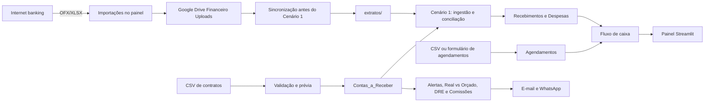

# Manual Operacional do Sistema Financeiro
## Casa da Árvore + Casarão Festas

**Versão:** 1.0  
**Data:** 19 de agosto de 2026  
**Responsável pelo documento:** Manus AI  
**Sistema:** Automação financeira V2 em Python, Google Sheets e painel Streamlit  
**Status:** Operação assistida; pronto para receber dados reais e ser ativado no ambiente contínuo

---

## 1. Finalidade deste manual

Este manual apresenta o procedimento completo para operar o Sistema Financeiro da Casa da Árvore e do Casarão Festas. O documento cobre a preparação inicial, o cadastro de contratos, o envio de extratos, o lançamento de compromissos futuros, a conciliação bancária, o acompanhamento do fluxo de caixa, a leitura da DRE, a análise de metas, as comissões, as notificações, a manutenção do agendador e o tratamento de falhas.

O sistema foi desenhado para separar três situações que não devem ser confundidas: **o que já aconteceu**, **o que está previsto** e **o que precisa de revisão manual**. A separação é essencial para que um compromisso futuro não seja tratado como despesa paga, para que uma parcela prevista não seja contabilizada antes do recebimento e para que uma transação bancária ambígua não seja baixada incorretamente.

> **Regra operacional central:** agendamento é previsão; extrato conciliado é realizado; DRE e comissões usam o realizado.

A arquitetura financeira, as abas, os cenários e os horários deste manual correspondem ao código publicado no repositório do sistema [1]. As regras de agendamento e fluxo de caixa projetado estão consolidadas no guia específico [2]. O checklist de ativação deve ser utilizado junto com este documento [3].

---

## 2. Acesso rápido

O painel gerencial está publicado em [sistemafinanceiro.streamlit.app](https://sistemafinanceiro-noljjkpic5pxfvvwdy2mwx.streamlit.app/). O caminho de entrada para os dados financeiros é:

```text
Painel financeiro → Importações
```

A página **Importações** concentra os três uploads operacionais:

| Ordem | Área | Arquivo ou informação | Destino |
|---:|---|---|---|
| 1 | Contratos | CSV de contratos e parcelas | Aba `Contas_a_Receber` |
| 2 | Extratos bancários | OFX ou XLSX, um arquivo por conta | Google Drive e, depois, pasta `extratos/` |
| 3 | Agendamentos | CSV de compromissos futuros | Aba `Agendamentos` |

Na mesma página estão os modelos para download, o checklist de preparação, a quantidade de registros existentes e as instruções de confirmação. A seleção de um arquivo **não grava automaticamente**. O sistema somente escreve depois de validar o arquivo, mostrar a prévia, exigir a confirmação do usuário e receber o comando de importação.

As credenciais, senhas, tokens e chaves não devem ser enviados pela tela de Importações. Elas permanecem nos Secrets do painel ou no arquivo `.env` protegido do servidor.

---

## 3. Visão geral do sistema

O sistema é formado por um painel gerencial, uma planilha central, um conjunto de cenários automáticos e um agendador contínuo. A planilha é a fonte compartilhada de dados operacionais; o código lê os extratos e a planilha, aplica as regras financeiras, grava os resultados nas abas corretas e envia notificações por e-mail e, quando configurado, WhatsApp.



A unidade Azevedo é compartilhada pela Casa da Árvore e pelo Casarão. Por isso, o sistema não deve presumir que qualquer crédito recebido nessa unidade pertence a uma empresa específica. O matching usa chaves Pix quando disponíveis, a unidade bancária quando ela é exclusiva e, principalmente, a combinação de valor e vencimento contra a aba `Contas_a_Receber` [4].

---

## 4. Perfis e responsabilidades

A operação segura depende de separar quem cadastra, quem confere e quem administra o sistema. Uma mesma pessoa pode acumular funções em uma operação pequena, mas a conferência deve continuar sendo feita conscientemente.

| Perfil | Responsabilidades principais | Não deve fazer |
|---|---|---|
| Gestor financeiro | Conferir contratos, validar conciliações, revisar órfãos e ambiguidades, acompanhar caixa, metas e DRE | Aprovar uma baixa sem verificar a origem bancária |
| Operador administrativo | Baixar extratos, preencher CSVs, fazer uploads, revisar prévias e acompanhar mensagens | Alterar fórmulas ou configurações técnicas |
| Responsável por contratos | Informar parcelas, vendedor, data de assinatura, vencimento e contatos do cliente | Cadastrar parcela sem identificador único |
| Responsável técnico | Manter `.env`, Secrets, dependências, servidor, serviço systemd e logs | Colocar segredos no Git ou compartilhar `credentials.json` |
| Vendedor | Conferir contratos assinados, comissões e cancelamentos atribuídos | Alterar manualmente o valor de uma comissão sem evidência documental |

Toda correção que altere valores, status de pagamento, data de baixa, cancelamento ou vínculo bancário deve ter uma justificativa operacional registrada internamente.

---

## 5. Princípios de operação

### 5.1. Fonte de verdade por assunto

A aba `Contas_a_Receber` é a fonte de verdade para contratos, parcelas, vencimentos e matching de recebimentos. As abas de recebimentos e despesas representam o realizado processado pelos cenários. A aba `Agendamentos` representa compromissos futuros e não substitui as abas de realizado.

### 5.2. Não misturar previsto e realizado

Uma receita agendada não é um recebimento. Uma despesa agendada não é uma despesa paga. O painel exibe o previsto no **Fluxo de caixa**, mas a DRE continua usando somente recebimentos, despesas, custos fixos e comissões que já foram registrados como realizados.

### 5.3. Não baixar por aproximação quando houver ambiguidade

O Cenário 1 procura uma parcela com valor dentro da tolerância de **R$ 1,00** e vencimento dentro de uma janela de **sete dias**. Se houver mais de uma candidata, a transação fica ambígua e não é baixada automaticamente. Essa trava protege contra uma baixa silenciosa na parcela errada [4].

### 5.4. Não executar dois agendadores simultaneamente

O `main.py` deve rodar em apenas uma máquina. Dois processos podem ler o mesmo período e tentar gravar os mesmos resultados em paralelo. Se for necessário migrar de servidor, desative o serviço antigo antes de ativar o novo.

---

## 6. Preparação inicial do ambiente

### 6.1. Escolha do ambiente contínuo

O agendador precisa ficar em uma VPS, Raspberry Pi ou computador da empresa que permaneça ligado. O painel Streamlit é uma interface web; ele não substitui o servidor que executa os cenários automaticamente.

O procedimento oficial usa o usuário `ubuntu`, o diretório `~/sistema-financeiro`, um ambiente virtual `.venv`, o fuso `America/Sao_Paulo` e o serviço `systemd` [5].

### 6.2. Instalação do projeto

Na máquina de produção:

```bash
git clone https://github.com/logaragutti-glitch/sistemafinanceiro.git ~/sistema-financeiro
cd ~/sistema-financeiro
python3 -m venv .venv
.venv/bin/pip install -r requirements.txt
cp .env.example .env
```

Coloque `credentials.json` na raiz do projeto. O arquivo deve ser uma credencial de service account e não pode ser enviado ao Git, a mensagens, ao painel ou a qualquer canal público.

### 6.3. Configuração do `.env`

Preencha os campos necessários do `.env`:

| Variável | Necessidade | Uso |
|---|---|---|
| `AGGREGATOR=arquivo` | Obrigatória no modo atual | Lê extratos OFX/XLSX exportados manualmente |
| `EXTRATOS_DIR=extratos` | Recomendada | Define onde o backend lê os extratos sincronizados |
| `GOOGLE_CREDENTIALS_FILE=credentials.json` | Obrigatória | Arquivo da service account |
| `SPREADSHEET_ID` | Obrigatória | Identifica a planilha operacional |
| `DRIVE_UPLOADS_FOLDER_ID` | Opcional | Fixa a pasta do Drive; vazia, o sistema localiza/cria `Financeiro Uploads` |
| `EMAIL_REMETENTE` | Necessária para e-mail | Conta que envia notificações |
| `EMAIL_SENHA_APP` | Necessária para e-mail | Senha de aplicativo, não a senha normal |
| `EMAIL_SMTP_HOST` | Necessária para e-mail | `smtp.gmail.com` ou `smtp.office365.com` |
| `EMAIL_SMTP_PORT` | Necessária para e-mail | Normalmente `587` |
| `GESTOR_EMAIL` | Necessária para alertas | Destinatário do gestor |
| `ANTHROPIC_API_KEY` | Necessária para análise Claude | Usada no Cenário 5 |
| `WHATSAPP_PHONE_ID` | Opcional na primeira ativação | Envio via WhatsApp |
| `WHATSAPP_TOKEN` | Opcional na primeira ativação | Autenticação do WhatsApp |
| `GESTOR_PHONE` | Opcional na primeira ativação | Telefone do gestor |

O WhatsApp pode ficar vazio durante a primeira ativação porque e-mail e WhatsApp são tratados como canais independentes. O e-mail deve ser testado antes de considerar a operação estabilizada.

### 6.4. Compartilhamento da planilha

Compartilhe a planilha com o e-mail `client_email` presente no `credentials.json`, usando permissão de **Editor**. Depois, execute:

```bash
.venv/bin/python -m scripts.criar_planilha
```

O script cria ou completa as abas com os headers esperados. Confirme especialmente a existência de `Contas_a_Receber`, `Agendamentos`, `Metas_Mensais`, `DRE_Automatico` e `RealVsOrcado`.

As metas atualmente definidas para o negócio são:

| Empresa | Meta mensal |
|---|---:|
| Casa da Árvore | R$ 200.000,00 |
| Casarão Festas | R$ 100.000,00 |

A meta deve estar na aba `Metas_Mensais`, não apenas no código. Para alterar a meta, atualize a planilha e mantenha o histórico de decisão do gestor.

---

## 7. Central de entrada: procedimento oficial de uploads

A rotina de entrada deve sempre começar pelo painel:

```text
Painel → Importações
```

A tela apresenta quatro indicadores: quantidade de parcelas, linhas de metas, agendamentos e expectativa de seis extratos. Use a ordem recomendada abaixo.

### 7.1. Etapa 1 — Importar contratos

Baixe o modelo em **Modelos para baixar antes de preencher → Baixar modelo de contratos** ou use `templates/contas_a_receber.csv`.

Preencha uma linha para cada parcela real. Os campos mínimos são:

| Campo | Regra operacional |
|---|---|
| `ID Contrato` | Identificador estável do contrato; não repetir em combinação com a parcela |
| `Parcela` | Número da parcela; para comissões, o primeiro registro deve começar com `1/` |
| `Empresa` | `Casa da Árvore` ou `Casarão Festas` |
| `Venue` | Local do evento ou unidade |
| `Evento` | Nome ou referência do evento |
| `Cliente` | Nome do cliente |
| `Vendedor` | Nome que deve existir em `config.VENDEDORES` para comissão |
| `Valor Total` | Valor total do contrato |
| `Valor Parcela` | Valor da parcela individual |
| `Vencimento` | Formato `YYYY-MM-DD` |
| `Data Assinatura` | Formato `YYYY-MM-DD`; usada no cálculo de comissão |
| `Status` | Normalmente `Aberto`; valores válidos incluem `Aberto`, `Atrasado`, `Pago` e `Cancelado` |
| `Fone Cliente` / `Email Cliente` | Pelo menos um contato para a régua de cobrança |

Depois de selecionar o CSV, confira a prévia e a quantidade de linhas novas. O sistema rejeita empresa inválida, data fora do padrão, valor negativo, parcela inválida, campos obrigatórios ausentes e duplicidades dentro do arquivo. Linhas que já existam pela combinação `ID Contrato` + `Parcela` são ignoradas.

Marque **Confirmo que este arquivo contém contratos reais e revisados** e clique em **Importar contratos novos**. Não use este upload para corrigir um pagamento já realizado; para isso, revise a parcela e a evidência bancária.

Também é possível validar pelo terminal, sem escrever:

```bash
.venv/bin/python -m scripts.importar_contas_receber --csv contratos.csv --dry-run
```

Depois da conferência:

```bash
.venv/bin/python -m scripts.importar_contas_receber --csv contratos.csv
```

### 7.2. Etapa 2 — Enviar extratos bancários

Exporte os extratos diretamente do internet banking em OFX ou XLSX. Envie um arquivo por conta na aba **2. Extratos bancários**.

Os nomes devem ser exatamente:

```text
AZEVEDO_SICOOB.ofx ou .xlsx
AZEVEDO_CAIXA.ofx ou .xlsx
AZEVEDO_ITAU.ofx ou .xlsx
PARKLAGOS_CAIXA.ofx ou .xlsx
PARKLAGOS_ITAU.ofx ou .xlsx
PORDOSOL_CAIXA.ofx ou .xlsx
```

O upload rejeita extensão não suportada, arquivo vazio, arquivo maior que 15 MB e nome de conta desconhecido. A tela mostra a conta reconhecida, o formato e o tamanho. Marque **Confirmo que os arquivos são extratos oficiais exportados do banco** e clique em **Enviar extratos para processamento**.

Os arquivos são persistidos na pasta `Financeiro Uploads` do Google Drive da service account. Antes do Cenário 1, o backend baixa os arquivos válidos para `extratos/` por meio de:

```bash
.venv/bin/python -m scripts.sync_extratos_drive
```

Se o sistema for operado sem Drive, o modo local continua aceitando arquivos diretamente em `extratos/`, desde que os nomes sejam os mesmos. Quando houver simultaneamente OFX e XLSX da mesma conta, o OFX tem prioridade no agregador.

O sistema mantém um registro de arquivos processados para impedir que um extrato baixado novamente conte transações antigas como novas. Não renomeie um arquivo de forma que ele passe a representar outra conta.

### 7.3. Etapa 3 — Importar agendamentos

Use a aba **3. Agendamentos** para cadastrar compromissos futuros que ainda não aconteceram. Baixe o modelo `templates/agendamentos.csv` ou use o formulário da página **Agendamentos**.

Os campos mais importantes são:

| Campo | Valores ou orientação |
|---|---|
| `ID Agendamento` | Identificador único; não reutilizar |
| `Tipo` | `RECEITA` ou `DESPESA` |
| `Empresa` | `Casa da Árvore` ou `Casarão Festas` |
| `Descrição` | Compromisso que será recebido ou pago |
| `Categoria` | Categoria gerencial, principalmente para despesas |
| `Favorecido` | Fornecedor, cliente ou origem da receita |
| `Valor` | Maior que zero |
| `Data Prevista` | Formato `YYYY-MM-DD` |
| `Recorrência` | `Única`, `Mensal`, `Semanal` ou `Anual` |
| `Status` | `Agendado` ou `Pendente` enquanto não realizado |
| `Data Baixa` | Preencher somente depois da realização |
| `ID Transação Banco` | Referência da transação conciliada, quando houver |
| `Observações` | Condições, centro de custo ou referência |

O agendamento entra no fluxo de caixa projetado. Ele não cria uma receita em `Recebimentos`, não cria uma despesa realizada, não muda a DRE e não gera comissão.

Quando o compromisso for efetivamente pago ou recebido e estiver conciliado, atualize o status para `Concluído` ou `Baixado` e informe a referência bancária. Se for cancelado, use `Cancelado`. Esses estados deixam de entrar na projeção.

### 7.4. O que não deve ser enviado pela central

Não envie credenciais, senhas, tokens, arquivos de configuração, PDFs de documentos pessoais ou arquivos que não tenham relação com os três fluxos. O `credentials.json`, o `.env`, tokens de WhatsApp e chaves de API são segredos de infraestrutura e devem ficar protegidos no servidor ou nos Secrets do Streamlit.

---

## 8. Planilha e abas operacionais

A planilha central possui as seguintes áreas principais:

| Aba | Função | Quem alimenta |
|---|---|---|
| `Contas_a_Receber` | Contratos, parcelas, vencimentos e status | Upload de contratos e Cenários 1/2 |
| `Recebimentos_CasaArvore` | Recebimentos conciliados da Casa da Árvore | Cenário 1 |
| `Recebimentos_Casarao` | Recebimentos conciliados do Casarão | Cenário 1 |
| `Despesas_CasaArvore` | Débitos classificados da Casa da Árvore | Cenário 1 |
| `Despesas_Casarao` | Despesas atribuídas ao Casarão | Revisão operacional ou cenário conforme regra configurada |
| `Comissoes_CasaArvore` | Comissões da Casa da Árvore | Cenário 3 |
| `Comissoes_Casarao` | Comissões do Casarão | Cenário 3 |
| `Custos_Fixos` | Custos fixos usados na DRE | Cadastro administrativo |
| `DRE_Automatico` | Demonstração de resultado | Cenário 6 |
| `RealVsOrcado` | Meta, pago, a vencer, projeção e desvio | Cenário 7 |
| `Metas_Mensais` | Metas por empresa | Gestor financeiro |
| `Agendamentos` | Receitas e despesas futuras | Painel ou upload |

Não renomeie as abas nem altere seus headers sem atualizar o código e os testes. Uma alteração visual deve ser feita no painel; uma alteração de estrutura deve ser feita pelo procedimento técnico de migração.

---

## 9. Rotina diária do operador

### 9.1. Antes das 06:00

O operador deve baixar os extratos atualizados das seis contas e enviá-los pela central **Importações → 2. Extratos bancários**. Caso a rotina esteja em modo local, salve os arquivos na pasta `extratos/`. Caso use o painel publicado, confirme que o upload terminou sem erro e que o nome da conta foi reconhecido.

Não use um extrato parcial se o banco permitir exportar o período completo desde a última execução. A deduplicação protege contra sobreposição, mas o arquivo precisa corresponder à conta correta.

### 9.2. Depois das 06:00

O Cenário 1 sincroniza os arquivos do Drive, lê as transações das últimas 24 horas, identifica créditos e débitos, tenta conciliar parcelas, grava recebimentos e despesas e envia avisos de órfãos ou ambiguidades.

O operador deve consultar o painel e a planilha depois da execução. Se uma transação ficar órfã ou ambígua, não deve alterar o status da parcela sem verificar o comprovante e a conta de origem.

### 9.3. Conferência diária dos alertas

O Cenário 2 marca como `Atrasado` toda parcela `Aberto` cujo vencimento já passou. Ele envia um resumo diário por empresa e aplica a régua de cobrança quando há telefone ou e-mail do cliente:

| Momento | Ação |
|---|---|
| D-3 | Lembrete de vencimento |
| D+1 | Primeira cobrança de parcela não identificada como paga |
| D+7 | Segunda cobrança |
| D+10 | Terceira cobrança |

Confirme se os contatos de cliente estão corretos antes de ativar a régua. Uma mensagem enviada para contato errado pode causar problema operacional e de relacionamento.

### 9.4. Conferência do fluxo de caixa

Abra **Fluxo de caixa** e confira as entradas realizadas, entradas previstas, saídas realizadas, saídas previstas e saldo projetado. O cálculo é:

```text
saldo projetado = entradas realizadas + entradas previstas
                  - saídas realizadas - saídas previstas
```

Se o painel mostrar zero, verifique primeiro o período selecionado, a conexão com a planilha e se existem contratos, agendamentos e extratos processados. Zero pode ser um estado correto de uma base vazia, mas também pode indicar um erro de configuração.

---

## 10. Rotina automática semanal

O `main.py` mantém os sete cenários agendados no fuso `America/Sao_Paulo`:

| Horário | Dia | Cenário | Objetivo |
|---:|---|---|---|
| 06:00 | Todos | 1 — Ingestão | Ler extratos, conciliar recebimentos e registrar débitos |
| 08:00 | Todos | 2 — Alertas | Marcar atraso, enviar resumo e executar cobrança |
| 08:15 | Todos | 7 — Real vs Orçado | Comparar pago e parcelas a vencer com a meta |
| 08:30 | Todos | 5 — Análise | Gerar análise diária com Claude |
| 17:00 | Sexta-feira | 4 — Relatório semanal | Consolidar receitas, despesas e margem simples |
| 17:30 | Sexta-feira | 6 — DRE | Calcular resultado mensal por empresa |
| 18:00 | Sexta-feira | 3 — Comissões | Calcular comissões e estornos da semana |

Os horários são definidos no código, e o serviço systemd fixa o fuso para evitar que uma VPS em UTC execute as rotinas três horas fora do horário esperado.

### 10.1. Execução manual de um cenário

Para executar um cenário sem esperar o horário, use:

```bash
.venv/bin/python -m scripts.run_once --cenario 1
.venv/bin/python -m scripts.run_once --cenario 2
.venv/bin/python -m scripts.run_once --cenario 3
.venv/bin/python -m scripts.run_once --cenario 4
.venv/bin/python -m scripts.run_once --cenario 5
.venv/bin/python -m scripts.run_once --cenario 6
.venv/bin/python -m scripts.run_once --cenario 7
```

Execute manualmente somente depois de entender o impacto do cenário. O Cenário 1 pode baixar parcelas e inserir recebimentos; o Cenário 2 pode enviar cobranças; os Cenários 3, 4, 5, 6 e 7 podem gravar relatórios e enviar notificações.

---

## 11. Regras do Cenário 1 — ingestão e conciliação

### 11.1. Créditos

O sistema ignora créditos abaixo de **R$ 500,00**. Para os demais, tenta identificar a empresa por chave Pix. Quando a conta pertence exclusivamente à Casa da Árvore, como Park Lagos e Pôr do Sol, a unidade pode resolver a empresa sem ambiguidade. Na unidade Azevedo, Casa da Árvore e Casarão compartilham contas e o sistema depende do matching.

O matching procura uma única parcela aberta ou atrasada com:

```text
valor da transação dentro de ± R$ 1,00
vencimento dentro de ± 7 dias
```

Quando encontra exatamente uma candidata, o sistema:

1. atualiza a parcela para `Pago`;
2. grava a data de pagamento;
3. grava o ID da transação bancária;
4. insere o recebimento na aba da empresa;
5. registra banco, evento, cliente e venue derivados da parcela.

Quando não encontra candidata, gera uma transação órfã e notifica o gestor. Quando encontra mais de uma candidata, gera uma transação ambígua e não baixa nenhuma parcela.

### 11.2. Débitos

Débitos são classificados por palavras-chave em categorias como decoração, utilidades, fornecedores, limpeza e outros. Em Park Lagos e Pôr do Sol, a unidade informa o venue. Na unidade Azevedo, o padrão é `Venue Principal` e a despesa é atribuída inicialmente à Casa da Árvore; despesas do Casarão na conta compartilhada exigem revisão manual.

Essa regra padrão não deve ser interpretada como prova de que toda despesa de Azevedo pertence à Casa da Árvore. O gestor deve revisar débitos compartilhados quando a descrição, o comprovante ou o fornecedor indicar o Casarão.

### 11.3. Tratamento de órfãos e ambiguidades

Para uma transação órfã, localize o contrato ou parcela correspondente, confirme valor, cliente, data e conta e então corrija a base de contratos antes de reexecutar. Para uma transação ambígua, reduza a ambiguidade preenchendo empresa, evento, cliente, venue ou vencimento corretos na planilha. Nunca force a baixa apenas porque o valor parece semelhante.

---

## 12. DRE — Demonstração do Resultado

O Cenário 6 gera a DRE semanalmente às sextas-feiras às 17:30, usando o mês atual. A DRE é calculada por empresa:

```text
impostos = receita bruta × alíquota do Simples
receita líquida = receita bruta − impostos
margem de contribuição = receita líquida − despesas variáveis − comissões
lucro operacional = margem de contribuição − custos fixos
margem % = lucro operacional ÷ receita bruta × 100
```

A estrutura gravada em `DRE_Automatico` contém:

| Campo | Origem |
|---|---|
| `Receita Bruta` | Recebimentos com data no mês |
| `Impostos` | Alíquota definida em `config.py` |
| `Receita Líquida` | Receita bruta menos impostos |
| `Custos Variáveis` | Despesas do mês |
| `Comissões` | Líquido das comissões do mês |
| `Margem Contribuição` | Receita líquida menos variáveis e comissões |
| `Custos Fixos` | Aba `Custos_Fixos` |
| `Lucro Operacional` | Margem de contribuição menos fixos |
| `Margem %` | Lucro operacional sobre receita bruta |

A alíquota atualmente configurada para Casa da Árvore e Casarão é de 10%. Esse número é parâmetro de negócio e deve ser confirmado pelo responsável contábil antes de uso como informação fiscal. O painel não substitui a contabilidade formal.

Agendamentos não entram na DRE. Uma despesa futura só aparece na DRE depois que houver registro realizado, conforme a regra contábil e operacional adotada pela empresa.

---

## 13. Metas e Real vs Orçado

O Cenário 7 roda diariamente às 08:15. Ele lê as metas da aba `Metas_Mensais`, soma o que foi pago no mês e as parcelas abertas ou atrasadas a vencer no mês e aplica uma redução de 10% por inadimplência esperada:

```text
projeção = pago no mês + parcelas a vencer no mês × 0,90
desvio % = (projeção − meta) ÷ meta × 100
```

O resultado é gravado em `RealVsOrcado`. Um alerta é enviado quando o desvio absoluto ultrapassa 10%.

Ao analisar o relatório, diferencie:

| Situação | Interpretação |
|---|---|
| Pago alto e a vencer baixo | O mês dependeu de recebimentos já realizados |
| Pago baixo e a vencer alto | O resultado depende de cobranças futuras |
| Projeção abaixo da meta | A equipe precisa revisar vendas, recebíveis, inadimplência e calendário |
| Meta ausente | O cenário não calcula a empresa até a meta ser cadastrada |

A projeção não é garantia de receita. É uma ferramenta gerencial para antecipar o risco de não atingir a meta.

---

## 14. Comissões

O Cenário 3 roda às sextas-feiras às 18:00. A regra configurada é comissão sobre o **valor total do contrato assinado**, não sobre cada parcela recebida. O sistema considera a parcela identificada como `1/N` para evitar duplicidade.

Para cada vendedor válido em `config.VENDEDORES`, o cenário:

1. identifica contratos assinados na semana;
2. soma o `Valor Total` dos contratos;
3. aplica o percentual do vendedor;
4. registra a comissão na aba da empresa;
5. envia a informação por e-mail e WhatsApp quando os contatos estiverem configurados.

Se um contrato for cancelado na semana, o sistema registra um estorno negativo. O status pode ser `A Pagar` quando há comissão líquida ou `A Descontar` quando o estorno supera a comissão da semana.

Antes da primeira execução, confirme os telefones e e-mails dos vendedores. Contatos de teste ou placeholders não devem permanecer em produção.

---

## 15. Relatórios e leitura do painel

### 15.1. Resumo

A página **Resumo** apresenta receita recebida, despesas pagas, resultado, valores em atraso, atingimento de meta, planejamento do caixa, comparação entre empresas, movimento financeiro, Real vs Orçado e alertas prioritários.

Os cards de planejamento não devem ser somados aos cards de realizado. O primeiro grupo responde “o que deve acontecer”; o segundo responde “o que já aconteceu”.

### 15.2. Fluxo de caixa

Use **Fluxo de caixa** para verificar entradas e saídas por período, empresa e venue. Ao cadastrar uma recorrência mensal, o sistema expande a ocorrência apenas para a visualização do período filtrado; a planilha mantém uma linha original e não recebe cópias mensais automáticas.

### 15.3. DRE

Use **DRE** para resultado operacional e margem. Se estiver vazia, confirme se o Cenário 6 já rodou, se existem recebimentos, despesas, custos fixos e comissões para o mês e se a planilha está acessível.

### 15.4. Operação

Use **Operação** para verificar conexão, quantidade de abas e sinais de prontidão. Mensagens de conexão devem ser tratadas antes de interpretar cards zerados como desempenho real.

---

## 16. Serviço contínuo e manutenção

A instalação padrão do serviço é:

```bash
cd ~/sistema-financeiro
.venv/bin/pip install -r requirements.txt
sudo cp deploy/systemd/sistema-financeiro.service /etc/systemd/system/
sudo systemctl daemon-reload
sudo systemctl enable --now sistema-financeiro
sudo systemctl status sistema-financeiro
```

O serviço executa `main.py` com o ambiente virtual do projeto, usa o usuário `ubuntu`, fixa o fuso `America/Sao_Paulo`, reinicia após falha e restringe a escrita às áreas operacionais previstas. Acompanhe os logs com:

```bash
journalctl -u sistema-financeiro -f
```

Comandos de manutenção:

| Objetivo | Comando |
|---|---|
| Ver status | `sudo systemctl status sistema-financeiro` |
| Reiniciar após atualização | `sudo systemctl restart sistema-financeiro` |
| Parar temporariamente | `sudo systemctl stop sistema-financeiro` |
| Habilitar no boot | `sudo systemctl enable sistema-financeiro` |
| Ver últimas 100 linhas | `journalctl -u sistema-financeiro -n 100 --no-pager` |
| Ver logs ao vivo | `journalctl -u sistema-financeiro -f` |
| Atualizar código | `git pull --ff-only origin main` |
| Atualizar dependências | `.venv/bin/pip install -r requirements.txt` |

Após atualizar o código, execute os testes antes de reiniciar o serviço:

```bash
.venv/bin/python -m py_compile main.py painel/app.py src/*.py scripts/*.py
.venv/bin/python tests/test_upload_utils.py
.venv/bin/python tests/test_cashflow.py
.venv/bin/python tests/test_dry_run.py
```

---

## 17. Diagnóstico de prontidão

Antes de colocar dados reais em produção, execute:

```bash
.venv/bin/python -m scripts.verificar_producao
.venv/bin/python -m scripts.verificar_producao --online
```

O diagnóstico deve ser interpretado assim:

| Resultado | Conduta |
|---|---|
| `OK` | Pode seguir para a próxima etapa, mantendo a conferência humana |
| `AVISO` | Avaliar impacto; não ignorar se envolver contato, meta ou extrato |
| `ERRO` | Não ativar o agendador até corrigir |

Não ative o serviço se houver erro de credencial, planilha inacessível, `Contas_a_Receber` vazia, extratos ausentes ou falta de canal de notificação necessário para a rotina.

Teste o agregador:

```bash
.venv/bin/python -m src.aggregator --test
```

Faça primeiro uma execução controlada do Cenário 1:

```bash
.venv/bin/python -m scripts.run_once --cenario 1
```

Confirme a baixa de uma parcela real, o recebimento correspondente, a ausência de duplicidade e a mensagem do gestor antes de liberar o restante da automação.

---

## 18. Tratamento de problemas comuns

| Sintoma | Causa provável | Procedimento |
|---|---|---|
| Painel abre com cards vazios | Sem contratos, extratos, metas ou abas legíveis | Verifique período, conexão, `Contas_a_Receber`, `Metas_Mensais` e o Cenário 1 |
| Menu não aparece | Cache ou versão antiga do Streamlit | Atualize com `Ctrl + F5`, feche e reabra; confirme o redeploy |
| Arquivo de contrato rejeitado | Header, data, empresa, valor ou parcela inválidos | Baixe o modelo novamente, corrija o CSV e reenvie |
| Extrato rejeitado | Nome de conta ou extensão inválida | Use exatamente os seis nomes de conta e OFX/XLSX |
| Extrato não processado | Arquivo não sincronizado ou conta incorreta | Rode `scripts.sync_extratos_drive`, confira `extratos/` e o log |
| Parcela não baixou | Valor/vencimento fora da tolerância ou empresa não identificada | Revise `Contas_a_Receber`, vencimento, valor e empresa |
| Transação órfã | Não existe uma parcela candidata | Cadastre/corrija o contrato real e revise o comprovante |
| Transação ambígua | Mais de uma parcela atende ao matching | Diferencie as parcelas; não force a baixa |
| DRE sem dados | Cenário 6 não rodou ou não há realizado | Execute o cenário após validar entradas e confira as abas |
| Meta não aparece | Linha ausente ou nome de empresa diferente | Corrija `Metas_Mensais` e use o nome oficial da empresa |
| E-mail não chega | SMTP, senha de app ou destinatário incorreto | Revise `.env` e teste o canal independentemente |
| WhatsApp falha, e-mail funciona | Token ou Phone ID inválido | Corrija a configuração do WhatsApp; o e-mail continua independente |
| Serviço parado | Falha de dependência, credencial ou exceção | Consulte `systemctl status` e `journalctl`, corrija e reinicie |
| Mesmos dados processados duas vezes | Dois agendadores ou log de processados perdido | Pare a segunda máquina, preserve `.processados.json` e audite as abas |

---

## 19. Procedimento de correção manual

Quando uma informação estiver errada, não apague linhas sem registrar o motivo. Siga esta ordem:

1. Identifique a origem: contrato, extrato, agendamento, regra de configuração ou erro de leitura.
2. Preserve o valor original em uma cópia ou registro de auditoria interno.
3. Corrija primeiro a fonte de verdade, normalmente `Contas_a_Receber`, `Agendamentos`, `Metas_Mensais` ou `Custos_Fixos`.
4. Verifique se a correção muda apenas o previsto ou também o realizado.
5. Reexecute somente o cenário necessário.
6. Confira se a nova execução não duplicou uma linha.
7. Registre data, responsável, motivo e resultado da correção.

Nunca use um novo agendamento para mascarar uma despesa já paga. Nunca marque `Pago`, `Concluído` ou `Baixado` sem uma evidência de realização ou conciliação.

---

## 20. Segurança e proteção de dados

Os seguintes arquivos e valores são secretos:

```text
.env
credentials.json
.streamlit/secrets.toml
WHATSAPP_TOKEN
EMAIL_SENHA_APP
ANTHROPIC_API_KEY
```

Eles não devem ser commitados, enviados pela central de uploads, anexados a mensagens ou armazenados em planilhas. O repositório deve permanecer privado. Use permissões mínimas na máquina de produção e compartilhe a planilha somente com pessoas que precisam operar os dados.

Extratos bancários, contatos de clientes, e-mails, telefones e contratos são dados sensíveis do negócio. Baixe-os apenas de canais oficiais, mantenha o computador de operação protegido e evite duplicar cópias locais sem necessidade.

O painel é uma interface de operação e não deve ser tratado como local para armazenar segredos. A central de Importações aceita dados financeiros operacionais, mas bloqueia credenciais por procedimento.

---

## 21. Backup e contingência

Antes de grandes alterações na planilha, faça uma cópia do arquivo no Google Drive e registre a data. Preserve os CSVs originais de contratos e agendamentos usados em cada carga, além dos extratos oficiais baixados do banco.

Se o servidor principal falhar:

1. pare o serviço na máquina antiga, se ela ainda estiver acessível;
2. restaure o repositório em uma máquina substituta;
3. copie `.env` e `credentials.json` por canal seguro;
4. restaure ou reconstrua a pasta `extratos/` a partir do armazenamento persistente;
5. preserve `extratos/.processados.json` quando possível;
6. instale dependências no `.venv`;
7. execute `verificar_producao --online`;
8. rode o Cenário 1 manualmente;
9. confira duplicidade e só então ative o systemd.

Não ative duas máquinas ao mesmo tempo. A planilha é compartilhada, mas isso não elimina o risco de dois processos gravarem o mesmo período.

---

## 22. Checklist diário

Use esta lista no início de cada dia:

| Verificação | Feito |
|---|:---:|
| Seis extratos foram exportados ou enviados pela central | ☐ |
| Nomes dos arquivos correspondem às seis contas | ☐ |
| O upload não apresentou erro | ☐ |
| O Cenário 1 executou no horário | ☐ |
| Não existem órfãos sem revisão | ☐ |
| Não existem ambiguidades sem decisão | ☐ |
| Parcelas pagas foram conciliadas corretamente | ☐ |
| Débitos compartilhados de Azevedo foram revisados | ☐ |
| Alertas e e-mails do Cenário 2 foram recebidos | ☐ |
| O fluxo de caixa foi conferido | ☐ |
| Agendamentos vencidos foram atualizados | ☐ |

---

## 23. Checklist semanal

Na sexta-feira, antes de considerar a semana encerrada:

| Verificação | Feito |
|---|:---:|
| Relatório semanal foi gerado às 17:00 | ☐ |
| DRE foi gerada às 17:30 | ☐ |
| Comissões foram calculadas às 18:00 | ☐ |
| Contratos assinados da semana estão cadastrados | ☐ |
| Cancelamentos foram informados com data correta | ☐ |
| Estornos foram conferidos com os vendedores | ☐ |
| Custos fixos estão atualizados | ☐ |
| Metas e Real vs Orçado foram analisados | ☐ |
| Desvios acima de 10% foram discutidos | ☐ |
| Cópias de segurança dos arquivos de entrada foram preservadas | ☐ |

---

## 24. Checklist de fechamento mensal

No fechamento do mês, o gestor deve confirmar que todos os recebimentos relevantes foram conciliados, que as despesas foram classificadas, que os contratos cancelados têm data de cancelamento, que os custos fixos estão completos e que a DRE foi gerada. Em seguida, compare a DRE com o extrato, revise o Real vs Orçado e mantenha os arquivos de suporte organizados.

O fechamento operacional não substitui a revisão contábil, fiscal ou tributária. A alíquota de imposto configurada no sistema é um parâmetro gerencial e deve ser validada pelo profissional responsável pela contabilidade.

---

## 25. Testes técnicos antes de alterações

Antes de publicar alteração de código ou atualizar o servidor, rode:

```bash
.venv/bin/python tests/test_upload_utils.py
.venv/bin/python tests/test_cashflow.py
.venv/bin/python tests/test_dry_run.py
.venv/bin/python -m py_compile main.py painel/app.py src/*.py scripts/*.py
```

O dry-run não acessa banco, planilha, WhatsApp ou e-mail reais. Ele serve para validar a lógica de negócio contra dados de teste em memória. Nunca use um dry-run como prova de que as credenciais de produção estão funcionando.

---

## 26. Critério de sistema pronto para operação real

O sistema pode ser considerado pronto para a primeira operação real quando todas as condições abaixo forem verdadeiras:

| Critério | Obrigatório |
|---|:---:|
| Painel publicado e acessível | Sim |
| CI do último commit aprovado | Sim |
| Planilha compartilhada com a service account | Sim |
| Abas e headers criados | Sim |
| Metas mensais conferidas | Sim |
| Contratos reais importados e revisados | Sim |
| Seis extratos disponíveis | Sim |
| `aggregator --test` aprovado | Sim |
| Diagnóstico online sem erros críticos | Sim |
| Primeiro Cenário 1 executado e auditado | Sim |
| E-mail do gestor testado | Sim |
| WhatsApp testado ou formalmente dispensado na primeira fase | Recomendado |
| Servidor contínuo único ativado | Sim |
| Rotina de backup definida | Sim |

O estado atual do código e do painel está preparado para esse fluxo. A ativação financeira real ainda depende da inserção dos contratos e dos extratos oficiais do negócio.

---

## 27. Referências do projeto

[1]: README.md "README do Sistema Financeiro"
[2]: AGENDAMENTOS_GUIA.md "Guia de Agendamentos e Fluxo de Caixa"
[3]: PRODUCAO_CHECKLIST.md "Checklist Final de Ativação"
[4]: src/scenario_1_ingest.py "Cenário 1 — ingestão e conciliação"
[5]: deploy/systemd/README.md "Execução contínua em VPS ou Raspberry Pi"
[6]: config.py "Parâmetros centrais do negócio"
[7]: src/scenario_2_alerts.py "Cenário 2 — alertas e cobrança"
[8]: src/scenario_3_commissions.py "Cenário 3 — comissões"
[9]: src/scenario_6_dre.py "Cenário 6 — DRE"
[10]: src/scenario_7_budget.py "Cenário 7 — Real vs Orçado"
